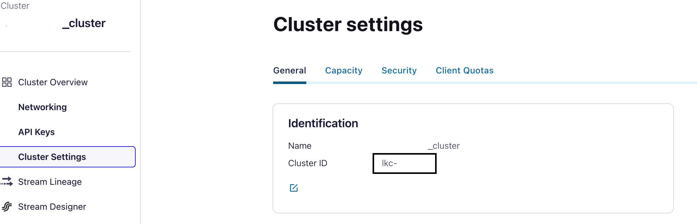

# Bidirectional cluster link

We are going to setup a [Bidirectional Cluster Link](https://docs.confluent.io/cloud/current/multi-cloud/cluster-linking/cluster-links-cc.html#bidirectional-mode) between a local Docker Compose based Confluent Platform Cluster and a Confluent Cloud Cluster.

The Confluent Platform side will authenticate to Confluent Cloud by using a Service Account, Confluent Cloud authentication to Confluent Platform will be disabled.
Please check [Confluent Cloud Security Model](https://docs.confluent.io/cloud/current/access-management/authenticate/overview.html), adding a cluster link to a secured Confluent Platform installation it's possible but the link created on Confluent Cloud must correctly configured, [link](https://docs.confluent.io/cloud/current/access-management/authenticate/overview.html).

You will be required to use [Confluent CLI](https://docs.confluent.io/confluent-cli/current/overview.html) for some steps.


## Start the local cluster
Start the local Confluent Platform installation
```shell
    docker-compose up -d
``` 

A Confluent Platform clusters is running:

*  Control Center is available at [http://localhost:19021](http://localhost:19021/)


## Setting up the Links

###  Create a Confluent Cloud cluster

1. For our Demo we require a Confluent Cloud Dedicate Public Cluster, please follow [this]( https://docs.confluent.io/cloud/current/clusters/create-cluster.html#create-ak-clusters) documentation page

2. Create a Service Account and Kafka Resource API Key, follow [this](https://docs.confluent.io/cloud/current/access-management/identity/service-accounts/manage-service-accounts.html#create-a-service-account-using-the-ccloud-console) documentation page: 

###  Setting up a Confluent Cloud Cluster Link

1. Retrive the Confluent Cloud Dedicated Cluster ID, enter in the Cluster Section, Cluster Settings, General Tab


2. Retrive the local cluster ID:
```shell
    docker-compose exec kafka \
    kafka-cluster cluster-id --bootstrap-server localhost:19092  
```

2. This step requires Confluent CLI, in case you do not have it please use point 3 as alternative. 
Using the local cluster Id we can create a Bidirectional Inbound Cluster Link by using the Confluent CLI:

```shell
    confluent kafka link create cp-source-initiated-noauth --cluster your_confluent_cloud_cluster_id --remote-cluster your_local_cluster_id --config-file data/source-initiated-bidirectional-destination.properties 
```

3. Verify that the Link has been created successfully by CLI:
```shell
confluent kafka link list
```

###  Confluent Platform Cluster Link
1. Configure the Cloud Bootstrap server (bootstrap.servers) and the Authentication parameters (sasl.jaas.config) by editing the conf. file source-initiated-bidirectional-source.properties
2. Create the Local Cluster Link:
```shell
docker-compose exec kafka \
kafka-cluster-links --bootstrap-server localhost:19092 --create --link cp-source-initiated-noauth --config-file source-initiated-bidirectional-source.properties --consumer-group-filters-json-file group-filter.json --topic-filters-json-file topic-filter.json --cluster-id your_confluent_cloud_cluster_id
```
3. Check that the Link has been created:
```shell
docker-compose exec kafka \
kafka-cluster-links --bootstrap-server localhost:19092 --list
```
### Results
We now have an integrated Confluent Platform and Confluent Cloud installation. We are also leveraging some features such as:
* [Consumer Group Offset Sync](https://docs.confluent.io/cloud/current/multi-cloud/cluster-linking/mirror-topics-cc.html#sync-consumer-group-offsets)
* [Automatic Topic Creation](https://docs.confluent.io/cloud/current/multi-cloud/cluster-linking/mirror-topics-cc.html#auto-create-mirror-topics)

## Testing out
### Automatic Topic Creation
Create a topic on Confluent Cloud, the topic will be available in a read only mode also on Confluent Platform. You can do the same on Confluent Platform.

If you do not want to leverage this feature you can always create manually the topic on one side and add such topic as a mirrored one on the other side. For example:
```shell
docker-compose exec kafka \
kafka-topics --create --topic helloworld --partitions 1 --bootstrap-server localhost:19092
```
```shell
confluent kafka mirror create helloworld --link cp-source-initiated-noauth
```
### Message Replication
By leveraging the Confluent Platform UI add a message to Confluent Platform not mirrored topic, you will notice that the message will also appear on Confluent Cloud. Do the same on Confluent Cloud.


### Consumer Group Offset Sync
In Confluent Platform we can check the list of Consumer Groups, you will notice some consumer Groups that are created by Consumer reading from Confluent Cloud:
```shell
docker-compose exec kafka \
kafka-consumer-groups --bootstrap-server localhost:19092 --list
```

In Confluent Cloud we are going to do the same:
1. Edit data/client_ssl.properties with your API_KEY and API_SECRET
2. 
    ```shell
    docker-compose exec kafka \
    kafka-consumer-groups --bootstrap-server confluent_cloud_boostrap_server --command-config client_ssl.properties --list
    ```

## Teardown
### Confluent Platform
```shell
    docker-compose down -v
``` 
### Confluent Cloud
1. Edit the Cluster Link configuration and disable automatic topic creation
2. Delete all the mirrored Topics
3. Delete the Cluster Link (cp-source-initiated-noauth)
4. Delete the Dedicated Cluster
5. If you have created a new Service Account delete it
## Additions Resources


